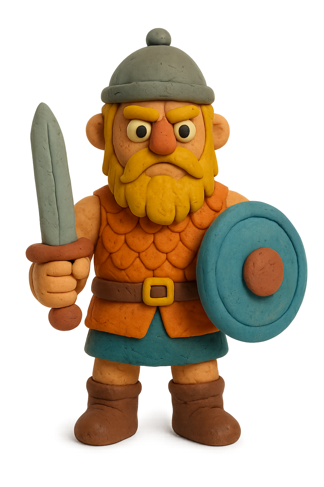

# Skald (this fork readme)
The idea of ​​this fork was born from the desire to fix some aspects of the standalone GUI (buttons, boxes and labels overlapping at the top left) and therefore from the attempt to implement some development ideas suggested by the author of the original repository (see the bottom of the readme).
New features:
- Added velocity selection for dot.
- Added multi-channel midi output selection for dot (with midi port selection in standalone).
- Added Hypereuclidean Logic (option to choose between standard mode (Skald MIDI Generative) or Hypereuclidean pattern generation)
- Fixed GUI bugs on standalone.
- ASIO & Jack support.
Only for Windows x64.

MIDI channel and velocity setting mode:

--> SHIFT + Vertical Drag: Changes the individual point's velocity.

--> ALT + Vertical Drag: Changes the individual point's MIDI channel.

--> Drag Only: Changes the point's position on the disk.

Original TODO ideas List (marked with an x ​​what has been done)
- [X] Multiple MIDI channels per dot (color-coded) ---> made in the fork 
- [X] Per-dot velocity ---> made in the fork
- [ ] Per-dot gate time
- [X] Euclidean rhythm generator (Hypereuclidean)
- [ ] MIDI CC modulation per dot
- [ ] Pattern preset browser
- [ ] MIDI file export
- [ ] Multiple concurrent turntables
- [ ] Tempo-independent mode


## Skald                                                # Skald (original readme)

<div align="center">



### Viking MIDI Warrior

**A generative MIDI sequencer inspired by mechanical rhythm machines**

[](https://github.com/josephvolmer/skald/releases)
[](LICENSE)
[](#installation)

[Features](#features) • [Installation](#installation) • [Quick Start](#quick-start) • [Documentation](docs/)

</div>

---

## Overview

**Skald** is a generative MIDI sequencer inspired by **Quintron's Drum Buddy** and **Playtonica's MIDI Color Sequencer Orbita** - mechanical rhythm machines that merge analog charm with hands-on performance.

Place notes on concentric rings, scratch like vinyl, and explore generative patterns with motor control, probability, swing, and velocity variation.

<div align="center">

</div>

---

## Features

### 🎯 **Intuitive Turntable Interface**
- Visual rotating sensor arm with real-time feedback
- Double-click to add/remove notes
- Drag dots to adjust timing and pitch
- Click outer ring for vinyl-style scratching

### 🎵 **Musical Intelligence**
- **13 Musical Scales**: Major, Minor, Pentatonic, Blues, Dorian, Phrygian, Lydian, Mixolydian, Locrian, Harmonic Minor, Melodic Minor, and Chromatic
- **12 Root Notes**: Complete chromatic key selection
- **±2 Octave Range**: Expand your melodic possibilities
- **Speed Control**: 0.25x to 4x tempo divisions

### 🎲 **Generative Power**
- **Probability (0-100%)**: Create evolving, unpredictable patterns
- **Swing (0-100%)**: Add groove and shuffle (50% = straight, 66% = triplet feel)
- **Velocity Variation (0-100%)**: Humanize performances with dynamic randomization
- **Velocity Control (1-127)**: Set global note dynamics
- **Gate Time**: Precise note length control in milliseconds

### 🎛️ **Performance Ready**
- **Motor Control**: Toggle between motorized and manual playback
- **Reverse Playback**: Flip patterns backward for creative variations
- **Scratching**: Real-time vinyl-style manipulation
- **BPM Sync**: Automatically locks to your DAW's tempo

### 💾 **Pattern Management**
- **Randomize**: Instantly generate creative starting points
- **Save/Load**: Build and recall your pattern library
- **12 Rings**: Create complex melodic sequences

---

## Installation

### Quick Install (macOS)

Building Skald automatically installs to your system:

```bash
# Clone the repository
git clone https://github.com/josephvolmer/skald.git
cd skald

# Build and install
make
```

**Installed locations:**
- **VST3**: `~/Library/Audio/Plug-Ins/VST3/Skald.vst3`
- **AU**: `~/Library/Audio/Plug-Ins/Components/Skald.component`
- **Standalone**: `build/Skald_artefacts/Release/Standalone/Skald.app`

### Platform-Specific Builds

<details>
<summary><b>Windows</b></summary>

```bash
# Requires Visual Studio 2019 or later
cmake -B build -G "Visual Studio 16 2019"
cmake --build build --config Release
```

VST3 output: `build/Skald_artefacts/Release/VST3/Skald.vst3`
</details>

<details>
<summary><b>Linux</b></summary>

```bash
# Install dependencies
sudo apt-get install build-essential libasound2-dev libx11-dev \
  libxrandr-dev libxinerama-dev libxcursor-dev libfreetype6-dev

# Build
cmake -B build -DCMAKE_BUILD_TYPE=Release
cmake --build build --config Release
```

VST3 output: `build/Skald_artefacts/Release/VST3/Skald.vst3`
</details>

### Requirements
- **JUCE Framework** 7.x or later
- **CMake** 3.15 or later
- **C++17** compatible compiler
- **macOS** 10.13+, **Windows** 10+, or **Linux** (Ubuntu 20.04+)

---

## Quick Start

### DAW Setup

> **⚠️ IMPORTANT**: Skald is a **MIDI generator**, not an instrument!

<div align="center">

</div>

**Setup Steps:**
1. Insert **Skald** on its own MIDI track (no instruments)
2. Create a **separate track** with your synth/instrument
3. **Route MIDI** from Skald's track → your synth track
4. Add dots and start creating!

📖 See [QUICK_START.md](docs/QUICK_START.md) for detailed DAW-specific instructions (Ableton, Logic, FL Studio, etc.)

### Basic Workflow

1. **Add Notes**: Double-click on the turntable to place dots
2. **Adjust Timing**: Drag dots around the circle to change when they trigger
3. **Change Pitch**: Drag dots between rings to change note pitch
4. **Experiment**: Use Randomize for instant inspiration
5. **Fine-tune**: Adjust probability, swing, and velocity for variation
6. **Save**: Store your favorite patterns

---

## Technical Specifications

### Plugin Formats
- **VST3** (Windows, macOS, Linux)
- **Audio Unit** (macOS only)
- **Standalone** (all platforms)

### MIDI Capabilities
- **Output Only**: Generates MIDI notes (no audio processing)
- **Channel Support**: MIDI channels 1-16 (currently channel 1)
- **Host Sync**: Automatically syncs to DAW tempo
- **Note Range**: Configurable via scales and octave shift

---

## Development

### Project Structure

```
Skald/
├── CMakeLists.txt              # Build configuration
├── Makefile                    # Cross-platform build helper
├── Source/
│   ├── PluginProcessor.h       # MIDI generation engine
│   ├── PluginProcessor.cpp     # Pattern playback & timing
│   ├── PluginEditor.h          # GUI interface
│   └── PluginEditor.cpp        # Turntable visualization
├── images/                     # Graphics and sprites
├── fonts/                      # Custom fonts (SIL OFL licensed)
├── docs/                       # Documentation
└── .github/workflows/          # CI/CD automation
```

### Building from Source

```bash
# Clone with submodules
git clone --recursive https://github.com/josephvolmer/skald.git
cd skald

# Build with Makefile
make                    # Build (default: Release)
make install            # Build and install to system
make clean              # Remove build directory
make help               # Show all targets

# Or use CMake directly
cmake -B build -DCMAKE_BUILD_TYPE=Release
cmake --build build --config Release -j4
```

### Contributing

Want to extend Skald? Ideas we're considering:

- [ ] Multiple MIDI channels per dot (color-coded) ---> made in the fork 
- [ ] Per-dot velocity ---> made in the fork
- [ ] Per-dot gate time
- [ ] Euclidean rhythm generator (Hypereuclidean)
- [ ] MIDI CC modulation per dot
- [ ] Pattern preset browser
- [ ] MIDI file export
- [ ] Multiple concurrent turntables
- [ ] Tempo-independent mode

---

## License

This project is licensed under **GPL-3.0** due to JUCE framework licensing requirements.

### JUCE Licensing
- **Open Source (GPL)**: Free to use and distribute under GPL-3.0
- **Commercial**: Requires [JUCE commercial license](https://juce.com/juce-licensing) (~$40/month) for closed-source distribution

See [LICENSE](LICENSE) for full details.

---

## Credits

<div align="center">

**Built with ⚔️ by [Beowulf Audio](https://github.com/josephvolmer)**

### Inspiration
**Quintron's Drum Buddy** • **Playtonica MIDI Color Sequencer Orbita**

### Built With
[JUCE Framework](https://juce.com) • [CMake](https://cmake.org)

---

### Support & Community

[](https://github.com/josephvolmer/skald/issues)
[](https://github.com/josephvolmer/skald)

[Documentation](docs/) • [Report Bug](https://github.com/josephvolmer/skald/issues) • [Request Feature](https://github.com/josephvolmer/skald/issues)

---


*Mechanical rhythm meets modern production.*

🎵 **Make something unique!** 🎵

</div>


