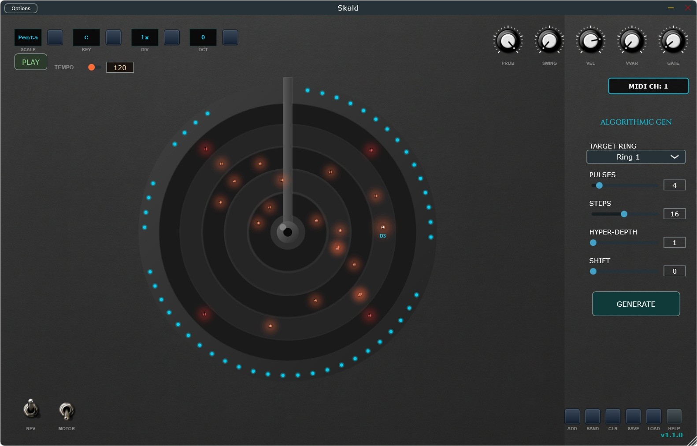

README

The idea of this fork was born from the desire to fix some aspects of
the standalone GUI (buttons, boxes and labels overlapping at the top
left) and therefore from the attempt to implement some development ideas
suggested by the author of the original repository (see the bottom of
the readme). 

New features:

> Added velocity selection for dot.
>
> Added gate-time selection for dot.
>
> Added channel midi output selection for dot
>
> Added midi port selection (on standalone, plugins works with DAW MIDI port).
>
> Added Hypereuclidean option: you can choose between the starting
> standard mode (the normal Skald MIDI Generative) or the Hypereuclidean
> pattern generation (pattern GENERATE button)
>
> Added Pulses and Steps to define how many strokes to distribute evenly
> in a number of subdivisions (e.g. 3 strokes over 8 steps), in Hypereuclidean pattern mode
> 
> Added MIDI export
> 
> Fixed GUI bugs on standalone and made GUI resizable.
>
> MIDI Multi-client, WindowsMidiServices, ASIO & Jack  support on Windows
> (Jack audio driver only, not Jack Midi) (*).
> 
> MIDI Learn system

ASIO and Jack Audio support are of little relevance, the app has a dummy 
stereo output so that it can be recognized and managed by the host as a 
synth and not as a MidiFX (due to the problems this causes in terms of writing on Windows).
Juce does not support Jack Midi on Windows.
Here only for Windows x64, using CMake v4.2.0, Juce v8.0.12 and Visual
Studio Community Edition 2026 Insiders on Windows 11 (but being a Juce project it can be
easily adapted for Mac and Linux).

MIDI Channel, Velocity, Gate Time and in-ring position change modes are:

--> Click on a single dot

--> Drag Only: Changes the point's position on the disk.

--> SHIFT + Vertical Drag: Changes the individual point's velocity.

--> CTRL/CMD + Drag: Adjusts Gate Time (how long that specific note
stays "pressed)

--> ALT + Vertical Drag: Changes the individual point's MIDI channel.

The "Help" button has been radically changed: previously, it opened a fixed screen with a list of
features and instructions for use. Since more functions and buttons have
been added, clicking "Help" now opens a PDF manual. However, it is
important that the manual be located in the same folder as the plugin or
executable (for standalone versions) and that the file name
"Skald_Manual.pdf" is not changed.

Original “TODO” ideas list (marked with an X what has been done here):

X   Multiple MIDI channels per dot (color-coded) 

X   Per-dot velocity

X   Per-dot gate time

X   Euclidean rhythm generator (here implemented as an Hypereuclidean pattern generator, an advanced customized  Euclidean) 
 
X   MIDI file export

> MIDI CC modulation per dot
>
> Pattern preset browser
>
> Multiple concurrent turntables
>
> Tempo-independent mode
> 

